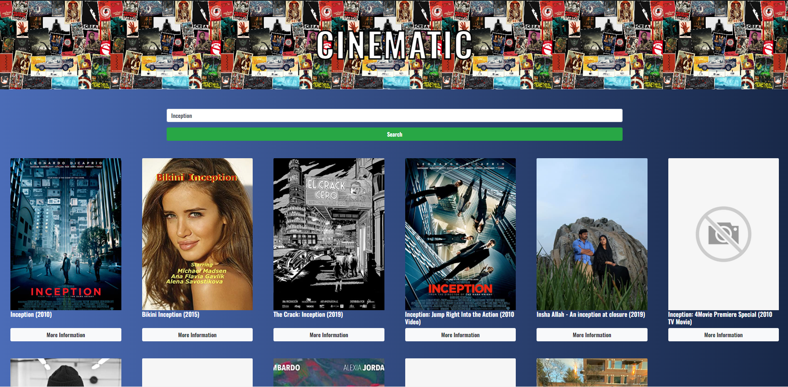
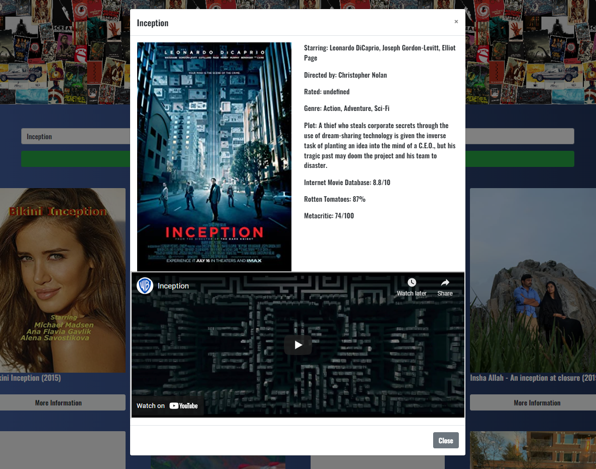

# CineMatic
With CineMatic you will be able to search movie titles using the iMDB and OMDB API's. Your search will query the search results into an easy to read platform. From your results, you can click to see more info for any of the titles. The additional details include The Casting, Directors, Genre, Plot, and the Ratings from IMDB, OMDB, and RottenTomatoes, and a functional Youtube trailer.

## Team
[Tom Nooman](https://github.com/tnoonan88) | [Ben Lin](https://github.com/yogs0ddhoth) | [Jonathan White](https://github.com/jwedcap) | [Derian Middleton](https://github.com/ItzDerian)

# The Application
Upon page load, several of the most recent and popular movies will populate the screen:
  
 

Using the search bar a user can enter in a particular movie or keywords of movie titles to populate a list of movies:
  
 

When the "More Information" button is clicked, a modal populated with information on the movie will pop up: 

 

# Link to the deployed application
https://tnoonan88.github.io/Cinematic-Film-Finder/

## Built with
- [jQuery - Ajax](http://www.w3schools.com/jquery/jquery_ref_ajax.asp) - jQuery simplifies HTML document traversing, event handling, animating, and Ajax interactions for rapid web development.
- [Bootstrap](http://getbootstrap.com/) - Extensive list of components and  Bundled Javascript plugins.

